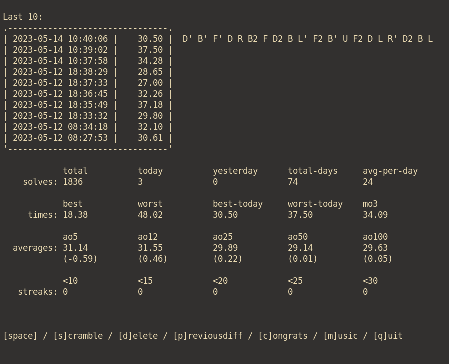

# CLICUBE: terminal based cube timer

## Version

| version | release date | details                                |
| ------- | ------------ | -------------------------------------- |
| v1.0.2  | 01/01/2023   | previous average difference, bug fixes |
| v1.0.1  | 31/12/2022   | yesterday count                        |
| v1.0.0  | 30/12/2022   | initial release                        |

## Description

_clicube_ is a simple 3x3 speed-cubing timer written in bash.

 

 

## Installation

Clone the repository

`git clone https://github.com/monotone-the-musical/clicube.git; cd clicube`

Run clicube.sh

`./clicube.sh`

If you want to access the program from anywhere, place the following command on your `~/.bashrc` or shell equivalent:

`export PATH="/path/to/dir/that/contains/file:$PATH"`

## Requirements

- GNU bash version 5 and up
- Mac OS currently not supported

## Commands

- Press and hold **[spacebar]** to prime the timer.
- Release **[spacebar]** to start the timer.
- Press the **[spacebar]** again to stop the timer, (auto-generates a new scramble).
- Will also work as single taps of the **[spacebar]** if you prefer.
- **s**: generate another \[s\]cramble.
- **d**: \[d\]elete the last recorded time.
- **p**: toggle showing time difference of \[p\]revious average.
- **1** - **9**: list recorded times (x 5).
- **q**: \[q\]uit.

## Stats

- All recorded times saved to `~/clicube.csv`
- Stats displayed: mo3, ao5, ao25, ao50 & ao100

### contact

- monotone.the.musical@gmail.com
- [Issues](https://github.com/monotone-the-musical/clicube/issues)
